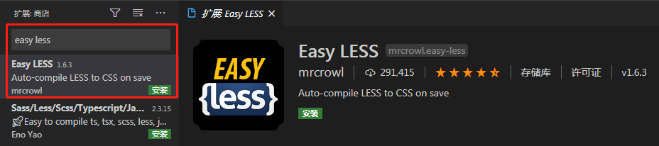

# 一、Less概述

## Less官网网站

http://lesscss.cn/

https://less.bootcss.com/


## 什么是LESS？

LESS是一个CSS预处理器，可以为网站启用可自定义，可管理和可重用的样式表。 LESS是一种动态样式表语言，扩展了CSS的功能。 LESS也是跨浏览器友好。

**CSS预处理器是一种脚本语言，可扩展CSS并将其编译为常规CSS语法，以便可以通过Web浏览器读取。** 它提供诸如变量，函数， mixins 和操作等功能，可以构建动态CSS。

## 为什么要使用LESS？

- LESS支持创建更简洁，跨浏览器友好的CSS更快更容易。
- LESS是用JavaScript设计的，并且创建在 live 中使用，其编译速度比其他CSS预处理器更快。
- LESS保持你的代码以模块化的方式，这是非常重要的，可读性更强和易于维护。
- 可以通过使用LESS 变量来实现更快的维护。

## 历史

LESS由 Alexis Sellier 于2009年设计。LESS是一个开源。 LESS的第一个版本是用Ruby编写的，在后来的版本中，它被JavaScript代替。

gitHub：https://github.com/less/less.js/

## 特征

- 更清晰和更可读的代码可以有组织的方式编写。
- 我们可以定义样式，它可以在整个代码中重复使用。
- LESS是基于JavaScript的，是超集的CSS。
- LESS是一个敏捷工具，可以排除代码冗余的问题。

## 优缺点

### 优点

- LESS轻松地生成可在浏览器中工作的CSS。
- LESS使您能够使用嵌套编写更干净，组织良好的代码。
- 通过使用变量可以更快地实现维护。
- LESS使您能够通过在规则集中引用它们来轻松地重用整个类。
- LESS提供使用操作，使得编码更快并节省时间。

### 缺点

- 学习新的CSS预处理需要时间。
- 由于模块之间的紧密耦合，应当采取更多的努力来重用和/或测试依赖模块。
- 与旧的预处理器(例如Sass)相比，LESS具有较少的框架，Sass由框架 Compass ， Gravity和 Susy 组成。

# 二、Less用法

## Less 命令行用法

使用命令行，我们可以将 .less 文件编译为 .css 。

### 安装lessc以供全局使用

以下命令用于使用npm(node package manager)安装lessc，以使less在全局可用。

```shell
npm install less -g
```

您还可以在包名称后面添加特定版本。 例如: npm install less@1.6.2 -g

### 安装Lessc用于节点开发

以下命令用于在项目文件夹中安装 *lessc* 最新版本。

```shell
npm i less -save-dev
```

它也被添加到你的项目package.json中的devDependencies。

- **lessc的测试版**

  当lessc结构发布到npm时，它被标记为beta，其中定期开发新的功能。 *less -v* 用于获取当前版本。

- **安装lessc** 的未发布开发版本

  当我们希望安装一个未发布版本的lessc并遵循将git URL标识为依赖的指令时，commit-ish将被指定。 这将确保您正在使用正确的leesc您的项目。

### 服务器端和命令行用法

**bin / lessc** 在存储库中包含二进制。 它的工作窗口，OS X和nodejs * nix。

### 命令行用法

当源设置为破折号或连字符( - )时，从标准输入读取输入。

```shell
lessc [option option=parameter ...]  [destination]
```

例如，我们可以使用下面的命令编译.less到.css

```shell
lessc stylesheet.less stylesheet.css
```

我们可以使用以下命令编译.less到.css by并将结果缩小。

```shell
lessc -x stylesheet.less stylesheet.css
```

### 选项

以下是在命令行使用中使用的选项。

| S.N. | 选项及描述                                                   | 命令                                                         |
| ---- | ------------------------------------------------------------ | ------------------------------------------------------------ |
| 1    | **Help**    显示帮助消息，其中包含可用的选项。               | `lessc -help lessc -h `                                      |
| 2    | **Include Paths** 它包括您希望在较少文件中简单和相对地引用的库的可用路径。 窗口中的路径由冒号(:)或分号(;)分隔。 | `lessc --include-path = PATH1; PATH2 `                       |
| 3    | **Makefile**   它输出一个makefile导入依赖列表到stdout。      | `lessc -M lessc --depends `                                  |
| 4    | **No Colo****r**彩色输出被禁用。                             | `lessc --no-color `                                          |
| 5    | **No IE Compatibility**  IE兼容性检查被禁用。                | `lessc --no-ie-compat `                                      |
| 6    | **Disable Javascrip****t**在较少的文件中禁用javascript。     | `lessc --no-js `                                             |
| 7    | **Lint**   检查语法和报告错误，没有任何输出。                | `lessc --lint lessc -l `                                     |
| 8    | **Silen****t**强制停止错误消息的显示。                       | `lessc --silent lessc -s `                                   |
| 9    | **Strict Imports**  力进口评价。                             | `lessc --strict-imports`                                     |
| 10   | **Allow Imports from Insecure HTTPS Host****s**允许从不安全的HTTPS主机导入。 | `lessc --insecure `                                          |
| 11   | **Version**  显示版本号并退出。                              | `lessc -version lessc -v `                                   |
| 12   | **Compres****s**有助于删除空白并压缩输出。                   | `lessc -x lessc --compress `                                 |
| 13   | **Source Map Output Filename**  它生成更少的源映射。 如果sourcemap选项没有定义文件名，那么它将使用扩展映射与源少文件名。 | `lessc --source-map lessc -source-map = file.map `           |
| 14   | **Source Map Rootpat****h**指定根路径，并应将其添加到源映射中较少的文件路径，并添加到输出css中指定的映射文件。 | `lessc --source-map-rootpath = dev-files / `                 |
| 15   | **Source Map Basepath**  指定的路径必须从输出路径中删除。Basepath与rootpath选项相反。 | `lessc --source-map-basepath = less-files / `                |
| 16   | **Source Map Less Inline**  所有少的文件应该包含在源映射中。 | `lessc --source-map-less-inline `                            |
| 17   | **Source Map Map Inline**  它指定在输出css中映射文件应该是内联的。 | `lessc --source-map-map-inline `                             |
| 18   | **Source Map URL**允许覆盖css中的地图文件中的点。            | `lessc --source-map-url = .. / my-map.json `                 |
| 19   | **Rootpath**  它在相对导入和URL中设置URL重写的路径。         | `lessc -rp = resources / lessc --rootpath = resources / `    |
| 20   | **Relative URL****s**在导入的文件中，重写URL以使URL始终相对于基本文件。 | `lessc -ru lessc --relative-urls `                           |
| 21   | **Strict Math**  它处理所有的数学函数在你的CSS。 默认情况下关闭 | `lessc -sm = on lessc --strict-math = on `                   |
| 22   | **Strict Unit****s**它允许混合单位。                         | `lessc -su = on lessc --strict-units = on `                  |
| 23   | **Global Variable**  定义可由文件引用的变量。                | `lessc --global-var =“background = green" `                  |
| 24   | **Modify Variable** 修改变量与全局变量选项相反，它移动您的less文件末尾的声明。 | `lessc --modify-var =“background = green" `                  |
| 25   | **URL Arguments**  要移动到每个URL，允许指定参数。           | `lessc --url-args =“arg736357" `                             |
| 26   | **Line Numbers** 生成内联源映射。                            | `lessc --line-numbers = comments lessc --line-numbers = mediaquery lessc --line-numbers = all ` |
| 27   | **Plugin**  它加载插件。                                     | `lessc --clean-css lessc --plugin = clean-css =“advanced"`   |

## Less 在浏览器中使用

Less可以在客户端上运行（IE6+、Webkit、Firefox），也可以在服务端运行（Node.js、Rhino）。

less在浏览器中使用，当你想编译less文件动态地需要而不是在服务器端，这是因为less是一个大的javascript文件。

首先，我们需要添加LESS脚本以在浏览器中使用LESS:

```html
<script src="less.min.js"></script>
```

要在页面上找到样式标签，我们需要在页面上添加以下行。 它还创建带有编译css的样式标签。

```html
<link href="styles.less" rel="stylesheet/less" type="text/css"/>
```

### 设置选项

在脚本标记之前，可以通过编程方式在较少的对象上设置选项。 它将影响less的所有编程使用和初始链接标记。

例如，我们可以设置选项如下:

```html
<script>
  less = {
    env: "development"
  };
</script>
<script src="less.js"></script>
```

我们还可以在脚本标记上以其他格式设置选项，如下所示:

```html
<script>
  less = {
    env: "development"
  };
</script>
<script src="less.js" data-env="development"></script>
```

您还可以将此选项添加到链接标记中。

```html
<link data-dump-line-numbers="all" data-global-vars='{ "var": "#fff", "str": "\"quoted\"" }' rel="stylesheet/less" type="text/css" href="less/style.less">
```

属性选项的要点如下:

- window.less是重要性级别。
- 无法在camel中写入数据属性，并将链接标记选项表示为时间选项。
- 具有非字符串值的数据属性应为JSON有效。

### 观看模式

可以通过将 env 选项设置为开发并在添加less.js文件后调用 less.watch()来启用观看模式 。 如果您希望暂时启用观看模式，请将#！watch 添加到网址。

```less
<script>less = { env: 'development'};</script>
<script src="less.js"></script>
<script>less.watch();</script>
```

### 修改变量

启用LESS变量的运行时修改。 当调用新值时，LESS文件被重新编译。 修改变量的基本用法是:

```less
less.modifyVars({
  '@buttonFace': '#eee',
  '@buttonText': '#fff'
});
```

### 调试

我们可以将选项*！dumpLineNumbers:mediaquery* 添加到上面提到的url或 *dumpLineNumbers* 选项。*mediaquery* 选项可与FireLESS一起使用(它显示LESS生成的CSS样式的原始LESS文件名和行号。)

### 选项

在加载脚本文件less.js之前，必须在全局对象中设置选项。

```html
<script>
  less = {
    env: "development",
    logLevel: 2,
    async: false,
    fileAsync: false,
    poll: 1000,
    functions: {},
    dumpLineNumbers: "comments",
    relativeUrls: false,
    globalVars: {
      var1: '"string value"',
      var2: 'regular value'
    },
    rootpath: ":/a.com/"
  };
</script>
<script src="less.js"></script>
```

- **async:**它是一个布尔类型。 无论是否使用选项async，都会请求导入的文件。 默认为false。
- **dumpLineNumbers:**这是一个字符串类型。 在输出css文件中，当设置dumpLineNumbers时，将添加源行信息。 它有助于调试特定规则来自。
- **env:**这是一个字符串类型。 env可以在开发或生产上运行。 当文档URL以 **file://** 开头或位于本地计算机中时，会自动设置开发。 
- **errorReporting:**当编译失败时，请设置错误报告方法。
- **fileAsync:**它是一个布尔类型。 当一个页面与文件协议，然后它请求是否异步导入。
- **functions:**它是对象类型和用户函数。
- **logLevel:**它是一种数字类型。 它在javascript控制台中显示日志记录级别。
  - 2:信息和错误
  - 1:错误
  - 0:没有
- **poll:**在手表模式下，轮询之间的时间以毫秒为单位。 它是一个整数类型，默认情况下设置为1000。
- **relativeUrls:**网址调整为相对，默认情况下，它设置为false，这意味着网址已经相对于条目少文件。它是一个布尔类型。
- **globalVars:**将全局变量列表插入代码。 字符串类型变量应该包含在引号中。
- **modifyVars:**它与全局变量选项相反，它移动您的less文件末尾的声明。
- **rootpath:**它设置每个URL资源开始时的路径。
- **useFileCache:**使用每个会话文件缓存。 较少文件中的缓存用于调用modifyVars，其中所有较少的文件将不会再次检索。

## Less 浏览器支持

LESS是跨浏览器友好的，支持诸如Google Chrome，Mozilla Firefox，Safari和Internet Explorer等现代浏览器，并允许重用CSS元素并使用相同的语义编写LESS代码。 在客户端使用LESS时，必须小心性能影响，如果存在外观问题(意味着拼写错误，颜色更改，纹理，外观，链接等)，则显示JavaScript。 编译服务器端的LESS文件，为网站提供更多性能。

PhantomJS【*PhantomJS*已死,有事烧纸】不实现 *Function.prototype.bind* 函数，因此您需要使用 *es-5 shim* JavaScript引擎在PhantomJS下运行。 用户可以使用变量进行调整以影响主题，并通过在生产中使用客户端LESS实时显示它们。

如果您想在旧版浏览器中运行LESS，请使用添加了LESS支持的JavaScript功能的 *es-5 shim* JavaScript引擎。 您可以使用浏览器必须支持的 *JSON.parse* ，在脚本或链接标签上使用属性。

```html
es5-shim：
	https://www.jscss.cc/2016/10/30/es5-shim.html

	https://github.com/douglascrockford/JSON-js
	https://github.com/es-shims/es5-shim
```

## Less 插件

插件可以上传来扩展网站的功能。 插件用于使您的工作更轻松。

### 命令行

要使用命令行安装插件，首先需要安装lessc插件。 该插件可以使用 *less-plugin* 开头安装。 下面是安装clean-css插件的命令行:

```shell
npm install less-plugin-clean-css
```

如果提及了无法识别的选项，那么它会尝试加载该选项并显示一条消息，说明*没有输入文件。*例如:

```shell
lessc --clean-css="advanced"
```

直接，您可以使用以下命令使用安装的插件:

```shell
lessc --plugin=path_to_plugin=options
```

### 在代码中使用插件

在Node中，插件是必需的，它作为一个选项插件传递给一个数组。

```js
var pluginName = require("pluginName");
less.render(myCSS, { plugins: [pluginName] })
   .then(function(output) {
    },
    function(error) {
    });
```

### 插件列表

以下是LESS中可用的插件列表。

#### 后处理器/功能插件

| S.N. | 插件及描述                                                   |
| ---- | ------------------------------------------------------------ |
| 1    | [**Autoprefixer** ](https://github.com/less/less-plugin-autoprefix)  它用于在从LESS转换后向CSS添加前缀。 |
| 2    | [**CSScomb** ](https://github.com/bassjobsen/less-plugin-csscomb/)  它有助于改进样式表的维护。 |
| 3    | [**clean-css** ](https://github.com/less/less-plugin-clean-css)  它缩小LESS的CSS输出。 |
| 4    | [**CSSWring** ](https://github.com/bassjobsen/less-plugin-csswring)  它压缩或缩小LESS的CSS输出。 |
| 5    | [**css-flip** ](https://github.com/bassjobsen/less-plugin-css-flip)  它用于从左到右(LTR)或从右到左(RTL)生成CSS。 |
| 6    | [**functions**](https://github.com/seven-phases-max/less-plugin-functions)  在LESS本身中写入LESS的函数。 |
| 7    | [**glob** ](https://github.com/just-boris/less-plugin-glob)  使用glob表达式，可以导入多个文件。 |
| 8    | [**group-css-media-queries** ](https://github.com/bassjobsen/less-plugin-group-css-media-queries)b>   它有能力做更少的后处理。 |
| 9    | [**inline-urls** ](https://github.com/less/less-plugin-inline-urls)  自动将网址转换为数据uri。 |
| 10   | [**npm-import** ](https://github.com/less/less-plugin-npm-import)  它有能力从npm包导入较少。 |
| 11   | [**pleeease** ](https://github.com/bassjobsen/less-plugin-pleeease)  它用于后处理Less。 |
| 12   | [**rtl** ](https://github.com/less/less-plugin-rtl)  LESS从ltr(从左到右)反转到rtl(从右到左)。 |

#### 框架/库 Importers

| S.N. | Importers 及描述                                             |
| ---- | ------------------------------------------------------------ |
| 1    | [**Bootstrap** ](https://github.com/bassjobsen/less-plugin-bootstrap/)  Bootstrap LESS代码在自定义LESS代码之前导入。 |
| 2    | [**Bower Resolve** ](https://github.com/Mercateo/less-plugin-bower-resolve)  LESS文件是从Bower软件包导入的。 |
| 3    | [**Cardinal CSS for less.js**](https://github.com/bassjobsen/less-plugin-cardinal)  在定制LESS代码之前，导入Cardinal的LESS代码。 |
| 4    | [**Flexbox Grid**](https://github.com/bassjobsen/less-plugin-flexboxgrid)  flexboxgrid导入。 |
| 5    | [**Flexible Grid System** ](https://github.com/bassjobsen/less-plugin-flexiblegs)  它进口柔性网格系统。 |
| 6    | [**Ionic** ](https://github.com/bassjobsen/less-plugin-ionic)  它进口离子骨架。 |
| 7    | [**Lesshat** ](https://github.com/bassjobsen/less-plugin-lesshat/)  它进口Lesshat mixins。 |
| 8    | [**Skeleton**](https://github.com/bassjobsen/less-plugin-skeleton)  它导入少骨骼代码。 |

#### 函数库

| S.N. | Importers 及描述                                             |
| ---- | ------------------------------------------------------------ |
| 1    | [**advanced-color-functions**](https://github.com/less/less-plugin-advanced-color-functions/) [ ](https://github.com/less/less-plugin-advanced-color-functions/)它用于找到更多的对比色。 [ ](https://github.com/less/less-plugin-advanced-color-functions/) |
| 2    | [**cubehelix** ](https://github.com/bassjobsen/less-plugin-cubehelix)  使用伽马校正值1，立方体角色函数可以返回两种颜色之间的颜色。 |
| 3    | [**lists**](https://github.com/seven-phases-max/less-plugin-lists)  列出操作函数库。 |

#### 插件作者

LESS允许作者结合较少。

```json
{
    install: function(less, pluginManager) {
    },
    setOptions: function(argumentString) {
    },
    printUsage: function() {
    },
    minVersion: [2, 0, 0]
}
```

- pluginManager提供了一个持有者，可以添加文件管理器，后处理器或访问者。
- setOptions函数传递字符串。
- printUsage函数用于解释选项。

#### 使用插件

```shell
cleancss -o one.less one.css
```

## Less 程序化使用

LESS中程序化使用的要点是 *less.render* 函数。 此函数在LESS中使用以下格式:

```js
less.render(input_data, options)
    .then(function(output) {
        //code here
    },
    function(error) {
    });
```

或者你可以用另一种方式写:

```js
less.render(css, options, function(error, output) {})
```

*options* 是一个可选参数，当您不指定回调时返回promise，并在指定回调时返回promise。 您可以通过将其读入字符串并设置主文件的文件名字段来显示文件。

*sourceMap* 选项允许设置sourcemap选项，例如 *sourceMapURL* ， *sourceMapBasepath* ，*sourceMapRootpath* ， *outputSourceFiles i>和 sourceMapFileInline 。 重要的是， sourceMap 选项不适用于less.js.*

您可以通过添加侦听器来访问日志，如下面的格式所示:

```js
less.logger.addListener({
    debug: function(message) {
    },
    info: function(message) {
    },
    warn: function(message) {
    },
    error: function(message) {
    }
});
```

上述定义的函数是可选的。 如果它显示错误，那么它会将错误传递给 *less.render* 中的回调或promise。

## Less 在线编译器

本节为大家介绍几款好用的 Less 在线编译器。

在线编译器用于将较少的代码编译为css代码。 在线编译器工具很容易帮助生成CSS代码。 

W3Cschool提供的在线编译器: [Less转CSS](https://www.w3cschool.cn/tools/index?name=LESS)

以下是其他的在线编译器:

- [less2css.org](http://less2css.org/)
- [winless.org/online-less-compiler](http://winless.org/online-less-compiler)
- [lesstester.com](http://lesstester.com/)
- [dopefly.com/less-converte](http://www.dopefly.com/less-converter/less-converter.html)
- [lessphp.gpeasy.com/demo](http://lessphp.gpeasy.com/Demo)
- [leafo.net/lessphp/editor](http://leafo.net/lessphp/editor.html)
- [estFiddle](http://ecomfe.github.io/est/fiddle/)
- [ILess](http://demo-iless.rhcloud.com/)

### 在线Web IDE / Playgrounds支持较少

以下是可用的在线Web IDE和Less支持。

| S.N. | 在线Web IDE和说明                                            |
| ---- | ------------------------------------------------------------ |
| 1    | [**CSSDeck Labs** ](http://cssdeck.com/labs)  它是可以快速，轻松地完成测试包，包括HTML，CSS，JS代码的地方。 |
| 2    | [**CodePen** ](https://code.en.io/)  它是前端网的操场。      |
| 3    | [**Fiddle Salad**](http://fiddlesalad.com/less/)  它是您可以在环境中添加准备好的代码的地方。 |
| 4    | [**JS Bin** ](http://jsbin.com/)  它的网站设计只帮助JavaScript和CSS代码。 |
| 5    | [**jsFiddle** ](http://jsfiddle.net/)  它是一个在线Web编辑器。 |

## Less GUIs

在本章中，我们将学习关于 GUI 的LESS 。 在这里您可以使用不同的LESS工具为您的平台。

下表列出了支持跨平台的GUI编译器。

| S.N. | 工具及描述                                                   |
| ---- | ------------------------------------------------------------ |
| 1    | [**Crunch 2！** ](http://getcrunch.co/)  它支持 *Windows* ， *Mac* 和 *Linux* 等跨平台。 它提供编辑器集成编译。 |
| 2    | **Mixture**  它是一个由设计师和开发人员使用的快速原型和静态网站生成工具。 它是快速，超强的，与你的编辑工作。 它汇集了一系列精彩的工具和最佳实践。 |
| 3    | [**SimpLESS** ](http://wearekiss.com/simpless)  它是一个简约的LESS编译器。 它提供拖放，删除和编译功能。 SimpLESS支持使用[前缀](http://prefixr.com/)(这是SimpLESS的独特功能)对您的CSS进行*前缀* 。 它建立在钛平台上。 |
| 4    | [**Koala**](http://koala-app.com/)  它用于编译LESS，SASS和CoffeeScript。 它提供的功能，如编译错误通知支持和编译选项支持。 |

下表列出了支持Windows平台的GUI编译器。

| S.N. | 工具和描述                                                   |
| ---- | ------------------------------------------------------------ |
| 1    | [**Prepros** ](https://prepros.io/)  它是一个工具，编译LESS，SASS，指南针，铁笔，玉和更多。 |
| 2    | [**WinLess** ](http://winless.org/)  最初它是一个LESS.app的克隆，它有几个设置，需要更多的功能完整的方法。 它支持从命令行参数开始。 |

下表列出了支持OS X平台的GUI编译器。

| S.N. | 工具和描述                                                   |
| ---- | ------------------------------------------------------------ |
| 1    | [**CodeKit** ](http://incident57.com/codekit/)  它是LESS.app的继承者，并支持LESS在许多其他处理语言，如SASS，翡翠，Markdown等。 |
| 2    | [**LiveReload** ](http://livereload.com/) 它编辑CSS和立即更改图像。 SASS，LESS，CoffeeScript和其他工作良好。 |
| 3    | [**Plessc** ](https://github.com/Mte90/Plessc)它是用PyQT制造的。 它具有日志查看器，自动编译，使用选择编辑器和sourcemap支持打开LESS文件的功能。 |

## Less 编辑器和插件

 编辑器是允许用户编辑文本的系统或程序。 插件是一种软件，用于扩展网站的功能。

### Eclipse

Eclipse 针对LESS的不同插件，如下表所列:

| S.N. | 插件和说明                                                   |
| ---- | ------------------------------------------------------------ |
| 1    | [Eclipse Less Plugin](http://www.normalesup.org/~simonet/soft/ow/eclipse-less.html)  通过扩展Eclipse IDE，此插件提供了编辑和编译LESS样式表的有用功能。 |
| 2    | [Transpiler Plugin](https://github.com/gossi/eclipse-transpiler-plugin)  这是Eclipse插件自动转译您的文件，如LESS，SASS，CoffeeScript等。 |

### Visual Studio

Visual Studio LESS的不同选项，如下表所列:

| S.N. | 选项和说明                                                   |
| ---- | ------------------------------------------------------------ |
| 1    | [CSS Is Less](https://visualstudiogallery.msdn.microsoft.com/dd5635b0-3c70-484f-abcb-cbdcabaa9923)  这个扩展使LESS文件用CSS语言服务打开。 |
| 2    | [Web Essentials 2012](https://visualstudiogallery.msdn.microsoft.com/07d54d12-7133-4e15-becb-6f451ea3bea6)  此扩展可让您更轻松地执行常见任务，并为Visual Studio for Web开发人员添加有用的功能。 |
| 3    | [Web Essentials 2013 ](http://vswebessentials.com/)  它扩展了Visual Studio中的许多新功能，而不是特定的语言或编辑器。 |
| 4    | [Web Tools 2013 ](http://www.asp.net/downloads)  您下载该工具并开始使用ASP.NET开发 |
| 5    | Easy LESS ，less文件中的代码不能直接被浏览器解析渲染，需要在koala等软件中编译后，才能生成对应的文件和css代码，然后浏览器解析它。如果想在less文件中写css代码，通过正常保存（ctrl+s），自动生成浏览器可以解析的代码，那么通过Easy LESS这个插件可以实现，这样不仅省去了繁琐使用软件编译less文件的过程，每次正常保存，就像写css代码一样，实时观察效果。 |

```html
配置Easy LESS:
	https://blog.csdn.net/qq_42757177/article/details/100050275?utm_medium=distribute.pc_relevant_t0.none-task-blog-BlogCommendFromMachineLearnPai2-1.edu_weight&depth_1-utm_source=distribute.pc_relevant_t0.none-task-blog-BlogCommendFromMachineLearnPai2-1.edu_weight
	
	https://blog.csdn.net/weixin_44198965/article/details/89923890
```



# 三、Less编译工具

## 在浏览器中使用

```html
<!DOCTYPE html>
<html>
	<head>
		<meta charset="UTF-8">
		<title></title>
		<style type="text/less">
			*{
				margin: 0;
				padding: 0;
			}
			#wrap{
				position: relative;
				width: 300px;
				height: 400px;
				border: 1px solid;
				margin: 0 auto;
				.inner{
					position: absolute;
					left: 0;
					right: 0;
					top: 0;
					bottom: 0;
					margin: auto;
					background: pink;
					height: 100px;
					width: 100px;
				}
			}
		</style>
	</head>
	<body>
		<div id="wrap">
			<div class="inner">
				
			</div>
		</div>
	</body>
	<script src="less/less.min.js"></script>
</html>
```

## 使用考拉编译less

考拉官网：http://koala-app.com/

```html
<!DOCTYPE html>
<html>
	<head>
		<meta charset="UTF-8">
		<title></title>
		<link rel="stylesheet" type="text/css" href="css/02.css"/>
	</head>
	<body>
		<div id="wrap">
			<div class="inner">
				
			</div>
		</div>
	</body>
</html>
```

```less
*{
    margin: 0;
    padding: 0;
}
#wrap{
    position: relative;
    width: 300px;
    height: 400px;
    border: 1px solid;
    margin: 0 auto;
    .inner{
        position: absolute;
        left: 0;
        right: 0;
        top: 0;
        bottom: 0;
        margin: auto;
        background: pink;
        height: 100px;
        width: 100px;
    }
}
```

# 四、Less注释

注释的适当使用可以保证代码的可读性，Less 支持两种类型的注释：多行注释和单行注释。

注释使代码清晰，并允许用户轻松地理解。 您可以在代码中使用多行注释和单行注释，但是当编译LESS代码时，单行注释不会显示在CSS文件中。

- 以//开头的注释，不会被编译到css文件中
- 以/**/包裹的注释，会被编译到css文件中

```html
<!DOCTYPE html>
<html>
	<head>
		<meta charset="UTF-8">
		<title></title>
		<link rel="stylesheet" type="text/css" href="css/03.css"/>
	</head>
	<body>
		<div id="wrap">
			<div class="inner">
				
			</div>
		</div>
	</body>
</html>
```

```less
/*这是想暴露出去的注释*/
//这是见不得人的注释
*{
    margin: 0;
    padding: 0;
}
#wrap{
    position: relative;
    width: 300px;
    height: 400px;
    border: 1px solid;
    margin: 0 auto;
    .inner{
        position: absolute;
        left: 0;
        right: 0;
        top: 0;
        bottom: 0;
        margin: auto;
        background: pink;
        height: 100px;
        width: 100px;
    }
}
```

# 五、Less变量

LESS允许使用 **@** 符号定义变量。 变量分配使用**冒号(:)**完成。

LESS中声明变量的格式为“@变量名：变量值”。

使用@来声明一个变量：@pink：pink；

1、作为普通属性值直接来使用：直接使用@pink；

2、作为选择器或属性名：@{选择器变量}、@{样式名变量}的形式

3、作为URL：@｛url｝

4、变量的延迟加载

## Less 变量概述

多次重复相同的值，通常在您的样式表中可看到。不用多次使用相同的值，可以使用变量。它使代码的维护更容易，并且可以从单个位置控制这些值。

```less
@color1: #ca428b;
.div1{
  background-color : @color1;
}
.div2{
  background-color : @color1;
}
```

## Less 变量插值

变量插值是评估包含一个或多个变量的表达式或文字的过程，产生其中变量用其对应值替换的输出。变量也可以在其他地方使用，如选择器名称，属性名称，URL和@import语句。

### 选择器

选择器可以引用任何变量，它是在编译时构建的。变量名称必须放在用**@**符号前缀的花括号（**{}**）内。

```less
@selector: h2;

@{selector} {
  background: #2ECCFA;
}
```

### URL

变量可用于保存URL。

```less
@images: "http://www.baidu.com";

.myclass {
  background : url("@{images}/images/less_variables/birds.jpg");
  width:800px;
  height:500px;
}
```

### 属性

变量可以由属性引用。

```less
@my-property: color;
.myclass {
  background-@{my-property}: #81F7D8;
}
```

## 案例

```html
<!DOCTYPE html>
<html>
	<head>
		<meta charset="UTF-8">
		<title></title>
		<link rel="stylesheet" type="text/css" href="css/04.css"/>
	</head>
	<body>
		<div id="wrap">
			<div class="inner">
				
			</div>
		</div>
	</body>
</html>
```

```less
/*这是想暴露出去的注释*/
//这是见不得人的注释
@color:deeppink;
@m:margin;
@selector:#wrap;
*{
    @{m}: 0;
    padding: 0;
}
@{selector}{
    position: relative;
    width: 300px;
    height: 400px;
    border: 1px solid;
    margin: 0 auto;
    .inner{
        position: absolute;
        left: 0;
        right: 0;
        top: 0;
        bottom: 0;
        margin: auto;
        background: @color;
        height: 100px;
        width: 100px;
    }
}
```

## 变量延迟加载

变量范围指定可用变量的位置。 变量将从本地作用域搜索，如果它们不可用，则编译器将从父作用域搜索。

所谓延迟加载：指的就是作用域里面的所有less编译完成之后，再使用变量值；

```less
@color: red;
.class {
@color: yellow;
    .brass {
      @color: blue;
      color: @color; 
      @color: green;
    }
  color: @color;  
}
```

# 六、Less嵌套规则

它是一组CSS属性，允许将一个类的属性用于另一个类，并且包含类名作为其属性。 在LESS中，可以使用类或id选择器以与CSS样式相同的方式声明mixin。 它可以存储多个值，并且可以在必要时在代码中重复使用。

1、基本嵌套规则

2、&的使用

```html
<!DOCTYPE html>
<html>
	<head>
		<meta charset="UTF-8">
		<title></title>
		<link rel="stylesheet" type="text/css" href="css/05.css"/>
	</head>
	<body>
		<div id="wrap">
			<div class="inner">
				
			</div>
		</div>
	</body>
</html>
```

```less
/*这是想暴露出去的注释*/
//这是见不得人的注释
@color:deeppink;
*{
    margin: 0;
    padding: 0;
}
#wrap{
    position: relative;
    width: 300px;
    height: 400px;
    border: 1px solid;
    margin: 0 auto;
    .inner{
        position: absolute;
        left: 0;
        right: 0;
        top: 0;
        bottom: 0;
        margin: auto;
        background: @color;
        height: 100px;
        width: 100px;
        &:hover{
            background: pink;
        }
    }
}
```

# 七、Less混合

混合类似于编程语言中的函数。 Mixins是一组CSS属性，允许您将一个类的属性用于另一个类，并且包含类名作为其属性。 在LESS中，可以使用类或id选择器以与CSS样式相同的方式声明mixin。 它可以存储多个值，并且可以在必要时在代码中重复使用。

## 普通混合

```html
<!DOCTYPE html>
<html>
	<head>
		<meta charset="UTF-8">
		<title></title>
		<link rel="stylesheet" type="text/css" href="css/01.css"/>
	</head>
	<body>
		<div id="wrap">
			<div class="inner">
				
			</div>
			<div class="inner2">
				
			</div>
		</div>
	</body>
</html>
```

```less
.juzhong{
    position: absolute;
    left: 0;
    right: 0;
    top: 0;
    bottom: 0;
    margin: auto;
    background: red;
    height: 100px;
    width: 100px;
}

#wrap{
    position: relative;
    width: 300px;
    height: 400px;
    border: 1px solid;
    margin: 0 auto;
    .inner{
       .juzhong;
    }
    .inner2{
       .juzhong;
    }
}
```

## 不输出的混合

可以创建一个mixin，它可以通过简单地放置括号后在输出中消失。

```less
.juzhong(){
    position: absolute;
    left: 0;
    right: 0;
    top: 0;
    bottom: 0;
    margin: auto;
    background: red;
    height: 100px;
    width: 100px;
}

#wrap{
    position: relative;
    width: 300px;
    height: 400px;
    border: 1px solid;
    margin: 0 auto;
    .inner{
       .juzhong();
    }
    .inner2{
       .juzhong();
    }
}
```

## 带参数的混合/多个参数

参数mixin使用一个或多个参数，通过参数和其属性来扩展LESS的功能，以便在混合到另一个块时自定义mixin输出。

```less
.juzhong(@w,@h,@c){
    position: absolute;
    left: 0;
    right: 0;
    top: 0;
    bottom: 0;
    margin: auto;
    background: @c;
    height: @h;
    width: @w;
}

#wrap{
    position: relative;
    width: 300px;
    height: 400px;
    border: 1px solid;
    margin: 0 auto;
    .inner{
       .juzhong(100px ,100px,pink);
    }
    .inner2{
       .juzhong(10px ,10px,green);
    }
}
```

## 带参数并且有默认值的混合

```less
.juzhong(@w:10px,@h:10px,@c:yellow){
    position: absolute;
    left: 0;
    right: 0;
    top: 0;
    bottom: 0;
    margin: auto;
    background: @c;
    height: @h;
    width: @w;
}

#wrap{
    position: relative;
    width: 300px;
    height: 400px;
    border: 1px solid;
    margin: 0 auto;
    .inner{
       .juzhong(100px ,100px,pink);
    }
    .inner2{
       .juzhong();
    }
}
```

## 命名参数

```html
<!DOCTYPE html>
<html>
	<head>
		<meta charset="UTF-8">
		<title></title>
		<link rel="stylesheet" type="text/css" href="css/02.css"/>
	</head>
	<body>
		<div id="wrap">
			<div class="inner">
				
			</div>
			<div class="inner2">
				
			</div>
		</div>
	</body>
</html>
```

```less
.juzhong(@w:10px,@h:10px,@c:pink){
    position: absolute;
    left: 0;
    right: 0;
    top: 0;
    bottom: 0;
    margin: auto;
    background: @c;
    height: @h;
    width: @w;
}

#wrap{
    position: relative;
    width: 300px;
    height: 400px;
    border: 1px solid;
    margin: 0 auto;
    .inner{
       .juzhong(100px ,100px,pink);
    }
    .inner2{
       .juzhong(@c:black);
    }
}
```

## 匹配模式

它相当于但又不完全是JS中的if，只有满足条件后才能匹配

**一句话总结匹配模式：**

相当于我传入一个值，这个值会去匹配与它对应的样式；

```html
<!DOCTYPE html>
<html>
	<head>
		<meta charset="UTF-8">
		<title></title>
		<link rel="stylesheet" type="text/css" href="css/03.css"/>
	</head>
	<body>
		<div id="wrap">
			<div class="sjx"></div>
		</div>
	</body>
</html>
```

```less
.triangle(@_,@wwww,@ccccc){
    width: 0px;
    height: 0px;
    overflow: hidden; 
}

.triangle(L,@w,@c){
    border-width: @w;
    border-style:dashed solid dashed dashed;
    border-color:transparent @c transparent transparent ;
}

.triangle(R,@w,@c){
    border-width: @w;
    border-style:dashed  dashed dashed solid;
    border-color:transparent  transparent transparent @c;
}

.triangle(T,@w,@c){
    border-width: @w;
    border-style:dashed  dashed  solid dashed;
    border-color:transparent  transparent @c transparent ;
}

.triangle(B,@w,@c){
    border-width: @w;
    border-style:solid dashed  dashed dashed;
    border-color:@c transparent  transparent transparent ;
}
```

### 导入指令

Less 中，可以通过 @import 指令来导入外部文件。

**@import** 伪指令用于在代码中导入文件。 它将LESS代码分布在不同的文件上，并允许轻松地维护代码的结构。 您可以将 *@import* 语句放在代码中的任何位置。

```less
@import "triangle.less";
#wrap .sjx{
   .triangle(R,40px,yellow)
}
```

## arguments变量

```html
<!DOCTYPE html>
<html>
	<head>
		<meta charset="UTF-8">
		<title></title>
		<link rel="stylesheet" type="text/css" href="css/04.css"/>
	</head>
	<body>
		<div id="wrap">
			<div class="sjx"></div>
		</div>
	</body>
</html>
```

```less
.border(@w,@style,@c){
    border: @arguments;
}

#wrap .sjx{
   .border(1px,solid,black)
}
```

## Mixin Guards

如果你想在表达式上匹配简单的值或参数数量，那么你可以使用Guards。 它与mixin声明相关联，并包括附加到mixin的条件。 每个mixin将有一个或多个由逗号分隔的防护，并且guard必须括在括号中。 LESS使用Guards的mixins而不是if / else语句，并执行计算以指定匹配的mixin。

```html
https://blog.csdn.net/ivenqin/article/details/107998153
```

### Guard比较运算符

LESS包含五个保护比较运算符：<，>，<=，> =和=。 您可以使用比较运算符（=）来比较数字，字符串，标识符等，而剩余的运算符只能与数字一起使用。

**示例代码：**

```html
<h2>Guard比较运算符的示例</h2>
<p class="myclass">Hello World!!!欢迎来到王者农药....</p>
```

**less代码：**

```less
.mixin (@a) when (@a = 20px){
color:red;
}

.mixin (@a) when (@a < 20px){
color:blue;
}

.mixin (@a) {
  font-size: @a;
}

.myclass { .mixin(20px) }
```

**编译之后:**

```css
.myclass {
  color: red;
  font-size: 20px;
}
```

### Guard逻辑运算符

您可以使用关键字来解决Guard逻辑运算符。 您可以使用和关键字组合使用保护条件，并使用not关键字取消条件。

**示例代码：**

```html
<h2>Guard逻辑运算符的示例</h2>
<p class="class1">Hello World...</p>
<p class="class2">欢迎来到王者农药...</p>
```

**less代码：**

```less
.mixin (@c, @bg) when (@c =red) and (@bg =yellow) {
    font-size: 30px;
}

// 如果文字颜色是蓝色或者背景为蓝色,文字大小是12px
.mixin (@c, @bg) when (@c =blue),
(@bg =blue) {
    font-size: 20px;
}

.mixin (@c, @bg) {
    color: @c;
    background: @bg;
}

.class1 {
    .mixin(red, yellow)
}

.class2 {
    .mixin(hotpink, black)
}
```

**编译之后:**

```css
.class1 {
  font-size: 30px;
  color: red;
  background: yellow;
}
.class2 {
  color: hotpink;
  background: black;
}

```

## 命名空间和访问器

它用于将mixins分组在通用名称下。 使用命名空间可以避免名称冲突，并从外部封装mixin组。

示例演示如何在LESS文件中使用命名空间和访问器:

```html
<h1>命名空间和访问器操作示例</h1>
<p class="myclass">Less可为网站提供可自定义、可管理、可重复使用的样式表。</p>
```

接下来，创建文件 style.less 。

```less
.class1 {
  .class2 {
    .val(@param) {
      font-size: @param;
      color:green;
    }
  }
}

.myclass {
  .class1 > .class2 > .val(20px);
}
```

编译之后：

```css
.myclass {
  font-size: 20px;
  color: green;
}
```

# 八、Less运算

LESS支持一些算术运算，例如加号(+)，减号( - )，乘法(*)和除法(/)，它们可以对任何数字，颜色或变量进行操作。 操作节省了大量的时间，当你使用变量，让感到就像是简单的数学工作。

```less
@fontSize: 10px;
.myclass {
 font-size: @fontSize * 2;
 color:green;
}
```

# 九、Less避免编译

它动态构建选择器，并使用属性或变量值作为任意字符串。

```less
p {
  color: ~"green";
}

*{
    margin: 100 *  10px;
    padding: ~"calc(100px + 100)";
}
```

在将LESS代码编译为CSS代码之后，〜“some_text"中的任何内容将显示为 some_text 。

# 十、Less继承

Extend是一个LESS伪类，它通过使用**:extend** 选择器在一个选择器中扩展其他选择器样式。

性能比混合高

灵活度比混合低

## 示例演示 :

```html
<div class="style">
    <h2>Welcome to Newcapec</h2>
    <p>Hello!!!!!</p>
</div>
```

接下来，创建文件 style.less

```less
h2 {
  &:extend(.style);
  font-style: italic;
}
.style {
  background: green;
}
```

编译之后：

```css
h2 {
  font-style: italic;
}
.style,
h2 {
  background: green;
}
```

## 继承案例

### 混合实现垂直居中

```html
<!DOCTYPE html>
<html>
	<head>
		<meta charset="UTF-8">
		<title></title>
		<link rel="stylesheet" type="text/css" href="css/mixin.css"/>
	</head>
	<body>
		<div id="wrap">
			<div class="inner">
				inner1
			</div>
			<div class="inner">
				inner2
			</div>
		</div>
	</body>
</html>
```

```less
.juzhong(@w,@h,@c){
    position: absolute;
    left: 0;
    right: 0;
    bottom: 0;
    top: 0;
    margin: auto;
    width: @w;
    height: @h;
    background: @c;
}
```

```less
*{
    margin: 0;
    padding: 0;
}

@import "mixin/juzhong-mixin.less";
#wrap{
    position: relative;
    width: 300px;
    height: 300px;
    border: 1px solid;
    margin: 0 auto;
    .inner{
        &:nth-child(1){
           .juzhong(100px,100px,deeppink);
        }
        &:nth-child(2){
           .juzhong(50px,50px,yellow);
        }
    }
}

```

### 继承实现垂直居中

```html
<!DOCTYPE html>
<html>
	<head>
		<meta charset="UTF-8">
		<title></title>
		<link rel="stylesheet" type="text/css" href="css/extend.css"/>
	</head>
	<body>
		<div id="wrap">
			<div class="inner test">
				inner1
			</div>
			<div class="inner">
				inner2
			</div>
		</div>
	</body>
</html>
```

**！important** 关键字用于覆盖特定属性。 当它在mixin调用之后放置时，它会将所有继承的属性标记为！important 。

```less
.juzhong{
    position: absolute;
    left: 0;
    right: 0;
    bottom: 0;
    top: 0;
    margin: auto;
}

.juzhong:hover{
    background: red!important;
}

```

```less
*{
    margin: 0;
    padding: 0;
}

@import "mixin/juzhong-extend.less";
#wrap{
    position: relative;
    width: 300px;
    height: 300px;
    border: 1px solid;
    margin: 0 auto;
    /*.inner:extend(.juzhong) 不友好*/
    .inner{
        &:extend(.juzhong all);
        &:nth-child(1){
           width: 100px;
           height: 100px;
           background: pink;
        }
        &:nth-child(2){
           width: 50px;
           height: 50px;
           background: yellow;
        }
    }
}

```

**CSS 预处理器 sass,less,stylus优缺点**

https://www.jianshu.com/p/9d84bb5043bb


