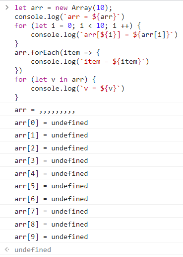
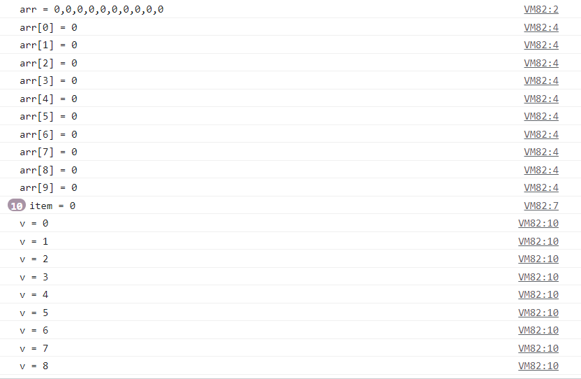

### ACM 模式输入输出
> [计算a+b的和](https://www.nowcoder.com/questionTerminal/dae9959d6df7466d9a1f6d70d6a11417)
>
> 每行包含两个整数a和b
>
> 对于每行输入对应输出一行a和b的和
>
> 输入
>
> 1 5
>
> 输出
>
> 6

+ ####  V8

```javascript
// line 是自己定义的用来接收输入的变量
while(line=readline()){
    var lines = line.split(' ');  //字符串转换为字符数组
    var a = parseInt(lines[0]);
    var b = parseInt(lines[1]);
    print(a+b);
}
```

+ #### NODE

```javascript
const readline = require('readline');
const rl = readline.createInterface({
    input: process.stdin,
    output: process.stdout
});
let nums;
rl.on('line', function(line){
    nums = line.split(' ')
    console.log(+nums[0] + +nums[1]);
}).on('close', function(){

})
```

### 位运算的坑

> 位运算符用于在最基本的层次上（即按照内存中表示数值的位来操作数值），ECMAScript中的所有数值都以IEEE-754 64位格式来存储，但位操作符并不直接操作64位的值。而是先将64位的值转换为32位的整数，再执行操作，最后再将结果转换为64位。
>
> 对于有符号的整数，32位中的后31位用于表示整数的值，第1位表示数值的符号：0表示正数，1表示负数。

+ 1 << 32 得到的是一个负数，要想得到这个值，可以用 ` Math.pow(2, 31)`

### 数组的坑

+ 新建数组的时候，记得 `fill(0)` (不然可能出现一些奇怪的不符合预期的情况)

  ```js
   let arr = new Array(10);
   console.log(`arr = ${arr}`)
   for (let i = 0; i < 10; i ++) {
       console.log(`arr[${i}] = ${arr[i]}`)
   }
   arr.forEach(item => {
       console.log(`item = ${item}`)
   })
   for (let v in arr) {
       console.log(`v = ${v}`)
   }
  ```

  输出结果如下, 注意`forEach`和`for...in...`是没有输出的，因为这两个遍历的时候，arr 里面的空和 `undefined`的空是不一样的，是不会进行遍历的（好像《你不知道的JavaScript》里面有提到，到时候回去翻翻）

   

   加了 `fill(0)`后，就都遍历出来了

   

+ 建多维数组的时候，不用用`fill(new Array(n))`这种方式去建，这样的话，就相当于每个位置都填了同一个引用，那么改变其中一个维度的值的时候，其他维度的值也会改变

  ```js
  // 这种方式填充的是同一个引用
  let Dovey = new Array(2).fill(new Array(3).fill(0))
  console.log(Dovey)
  Dovey[0][0] = 100
  console.log(Dovey)
  // > [[0,0,0],[0,0,0]]
  // > [[100,0,0],[100,0,0]]
  
  // 这种方式才是独立的引用
  let Dovey2 = new Array(2).fill(0).map(item => new Array(3).fill(0))
  console.log(Dovey2)
  Dovey2[0][0] = 100
  console.log(Dovey2)
  // > [[0,0,0],[0,0,0]]
  // > [[100,0,0],[0,0,0]]
  ```

  

+ 