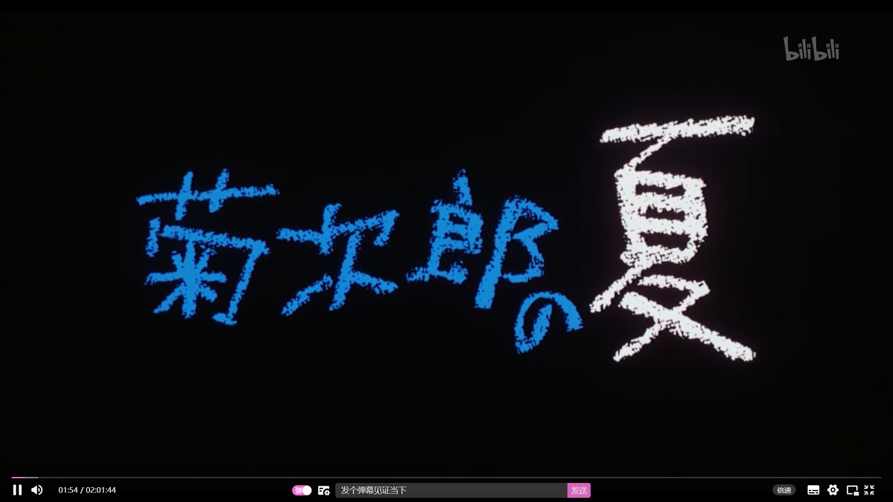

## 四时最好是三月，一去不回唯少年

### 2022-3-1

+ 字节校园每日一题

+ 学习瀑布流
  + 看别人博客
    + [瀑布流1](https://juejin.cn/post/6963071339108237319)
    + [瀑布流2](https://juejin.cn/post/6844904004720263176)
+ 练习 js 的输入输出（ACM 模式）
  + 树
  + 链表
  
  忽然发现之前都是用 vector 来做
+ 学一下使用浏览器的 performance
+ 学习一下 node 后端相关的
+ 完善一下后台管理系统

+ 总结rest参数、扩展运算符、箭头函数

### 2022-3-2

+ 字节校园每日一题

+ 看 ts 文档

+ 学习在markdown上用小图标

  1. 查看相应的Unicode，可查阅[这里](https://apps.timwhitlock.info/emoji/tables/unicode#)
  2. 假设一个图标的 Unicode 是 `U+1F601`，那么去掉前面的`U+`,同时在前面加上`&#x`,在后面加上分号，就能显示出来了。比如`&#x1F601;`显示的就是&#x1F601;

+ 继续做后台管理系统

  
  

### 2022-3-3

+ 字节校园每日一题：[编辑距离](https://leetcode-cn.com/problems/edit-distance/)

  ```js
  // dp[i-1][j-1] 表示替换操作，dp[i-1][j] 表示删除操作，dp[i][j-1] 表示插入操作。
  var minDistance = function(word1, word2) {
      let n = word1.length, m = word2.length;
      let dp = new Array(n + 1).fill(0).map(() => new Array(m + 1).fill(0));
      for (let i = 0; i <= n; i++)    dp[i][0] = i;
      for (let i = 0; i <= m; i++)    dp[0][i] = i;
      for (let i = 1; i <= n; i++) {
          for (let j = 1; j <= m; j++) {
              if (word1[i - 1] === word2[j - 1]) {
                  dp[i][j] = Math.min(dp[i - 1][j - 1], dp[i][j - 1] + 1, dp[i - 1][j] + 1);
              }
              else {
                  dp[i][j] = Math.min(dp[i - 1][j - 1], dp[i][j - 1], dp[i - 1][j]) + 1;
              }
          }
      }
      return dp[n][m]
  };
  ```

  

+ [获取 url 中的参数](https://www.nowcoder.com/practice/a3ded747e3884a3c86d09d88d1652e10)

+ 学习计网

### 2022-3-4

+ 字节校园每日一题
+ 跟着视频手写简易版promise
+ 学习计网
+ 写一遍八大排序

### 2022-3-5

+ 字节校园每日一题
+ 做一下别人的面试题
+ 看博客
+ 双周赛
+ 双栏布局（定宽+自适应）的多种实现

### 2022-3-6

+ 周赛
+ 字节校园每日一题
  + 涉及到自动机
+ 完成周赛没完成的题
  + 拓扑有时间回头复习一下

### 2022-3-7

+ 字节校园每日一题
+ flex： 1
+ 自己模拟一下跨域
+ div 垂直居中
+ 思考一下你的优势是什么？
+ 看之前收藏的博客

### 2022-3-8

+ 字节校园每日一题 + 春招冲刺三题
+ 一道别人之前的面试题（花了挺久时间做，也有不少收获）
  + 更加理解了 promise
  + 首次使用 fetch 请求数据
  + 用 node 写了一个小接口来模拟数据

### 2022-3-9

+ 字节校园每日一题 + 春招冲刺三题

+ nest 两小时入门教程

+ 怎么理解 vue 和 nest 这些框架说的渐进式

  > 就是一开始不需要你完全掌握它的全部功能特性，可以后续逐步增加功能。没有多做职责之外的事情
  >
  > + 使用 vue
  >
  > 	1. vue.js只提供了vue-cli生态中最核心的组件系统和双向数据绑定
  >
  > 	2. 就好像 vuex、vue-router都属于围绕vue.js开发的库
  >
  > + 使用Angular，必须接受以下东西
  >
  > 	1. 必须使用它的模块机制
  >
  > 	2. 必须使用它的依赖注入
  >
  > 	3. 必须使用它的特殊形式定义组件
  >
  > 	所以Angular是带有比较强的排它性的，如果你的应用不是从头开始，而是要不断考虑是否跟其他东西集成，这些主张会带来一些困扰
  >
  > + 使用React，你必须理解
  >
  >	1. 函数式编程的理念
  >
  > 	2. 需要知道它的副作用
  >
  > 	3. 什么是纯函数
  >
  > 	4. 如何隔离、避免副作用
  >
  > 	它的侵入性看似没有Angular那么强，主要因为它是属于软性侵入的

+ 了解 CSRF 、xss

### 2022-3-10

+ 字节校园每日一题 + 春招冲刺三题
+ 有点失忆的样子。。。想不起来做了啥，摸鱼？

### 2022-3-11

+ 学习双向绑定原理
+ 字节校园每日一题 + 春招冲刺三题
+ MVC 和 MVVM 的区别

### 2022-3-12

+ 看《菊次郎的夏天》

  + 很温馨，很有童年的味道

  + 人物形象刻画地也不错

    

+ 跟着视频做项目

+ 字节校园每日一题 + 春招冲刺三题

### 2022-3-13

今天花了好多时间在算法题上 orz 太菜了

+ 周赛
+ 字节校园每日一题 + 春招冲刺三题

### 2022-3-14

+ 字节校园每日一题 + 春招冲刺三题

+ hash 模式和 history 模式
  + history 模式上线后要配置 nginx，不然可能出问题
+ 看一下计网
+ 跟着视频做项目

### 2022-3-15

+ 字节校园每日一题 + 春招冲刺三题

+ 跟着视频做项目
  + 学了一下怎么使用 fastmock
+ 制作简历

+ 复习 js 垃圾回收机制

+ 和 Yabo 进行查漏补缺

### 2022-3-16

+ 搭个图床
+ 字节校园每日一题 + 春招冲刺三题
+ 学习 `WeakMap` `WeakSet` `Map` `Set`
+ 跟着视频做项目
  + 改一个bug花了好多时间。原因是把请求拦截器复制一份到响应拦截器的时候，忘记把request改成response了。这个时候就只会后面的request生效。如果是多个response的话，就前面的生效。

### 2022-3-17

+ 字节校园每日一题 + 春招冲刺三题
+ 跟着视频做项目
+ 互相查漏补缺环节
+ 配置GitHub主页